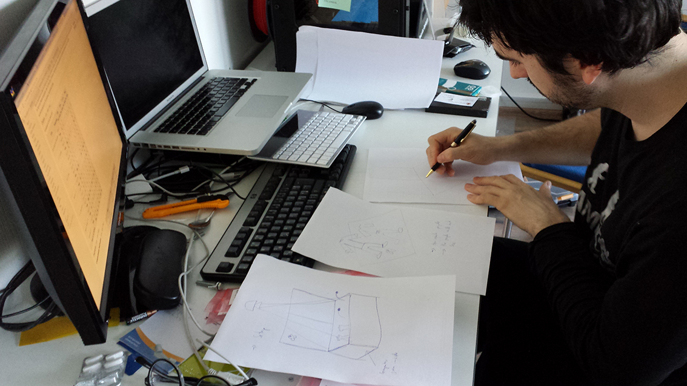
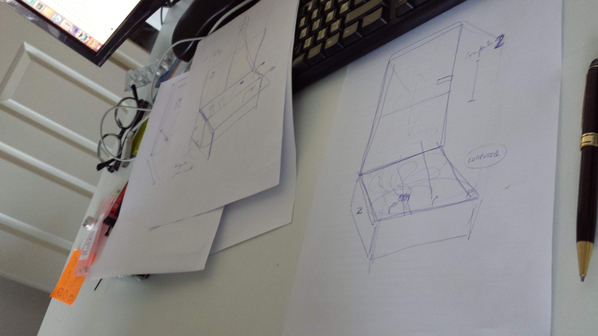
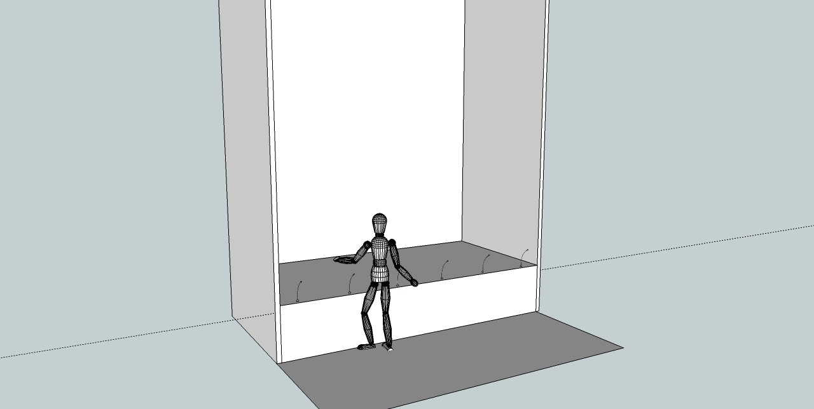
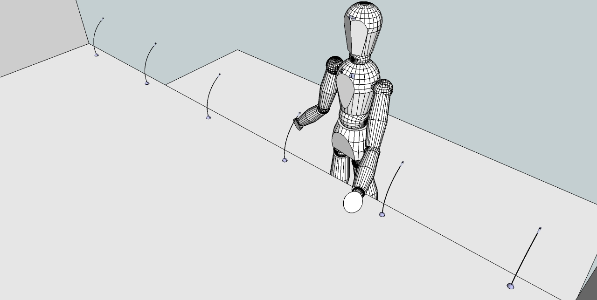

# Exhibition setup
Making a number of sketches to figure out the best exhibition setup:

Our main concernis were clear interaction for the audience and robust responds from the installation side. For example, one needs to understand how and where to make a wish and how to interact with the butterflies. From the other side, the system should understand that the wish is made, and also, detect the hands where butterflies can land upon.

