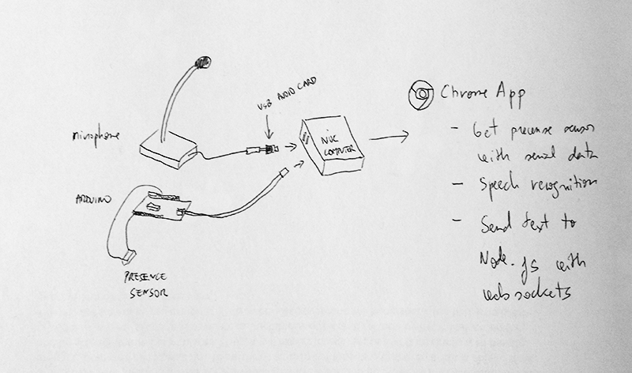

#Chrome app
For three wish stations, where one could say a wish, we have developed a Chrome app that uses speech recognition api from Google.
The presence sensor is necessary because of microphone activation. This is also managed by the Chrome app.

