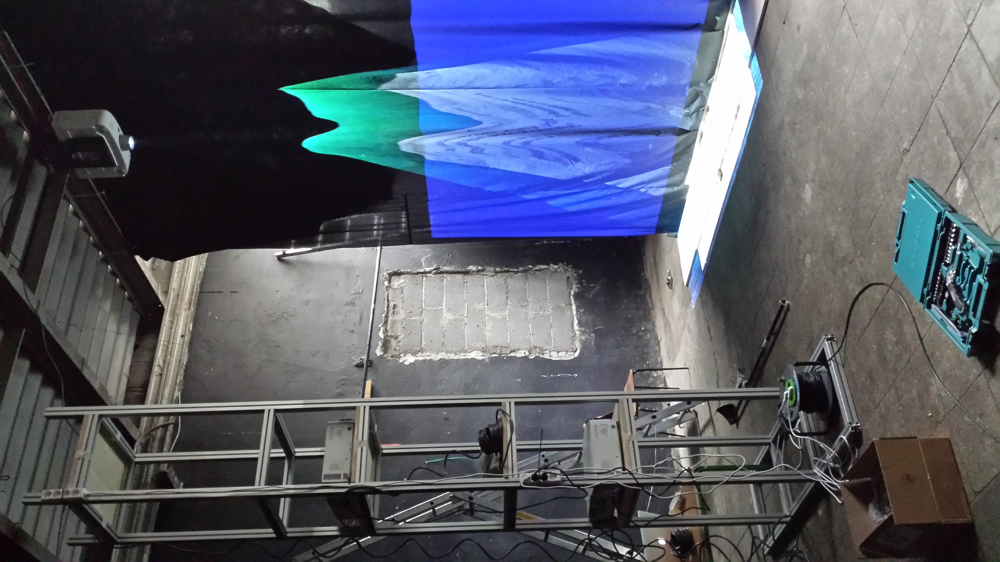
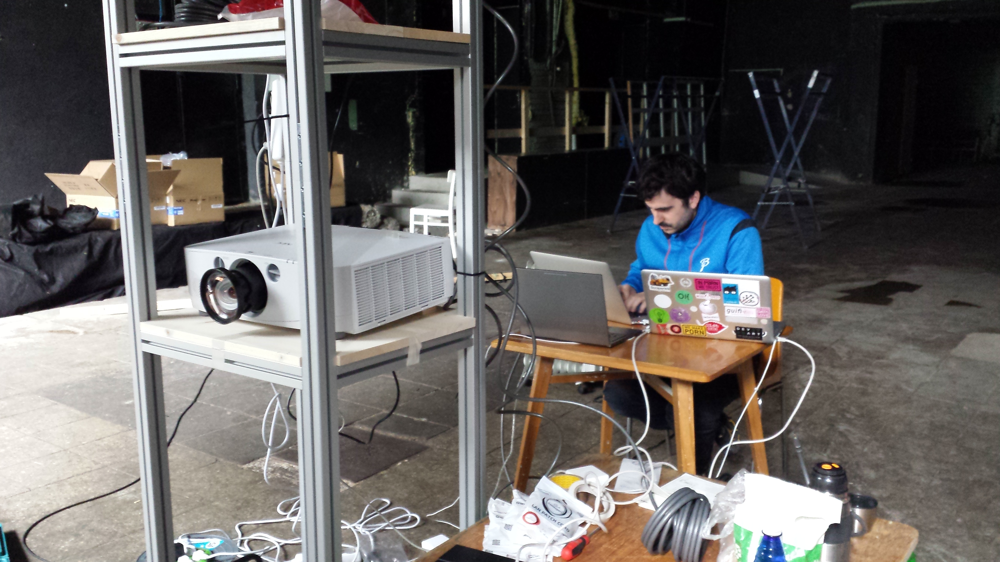

#Testing Set Up
Before going to London to set up Wishing Wall installation in Barbican, we have created as close set up to exhibition space one as possible (in terms of dimensions and the position of projectors). For doing that we had many reasons:
1. to test the equipment
2. try out and make changes in interaction and story board of the piece
3. test and impove code
4. make key stoning and blending for 3 projectors.
5. see real dimensions of graphical part. again changes and improvements.

