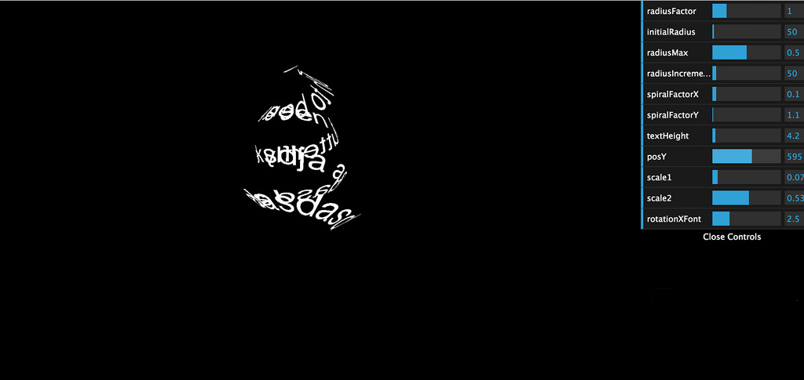
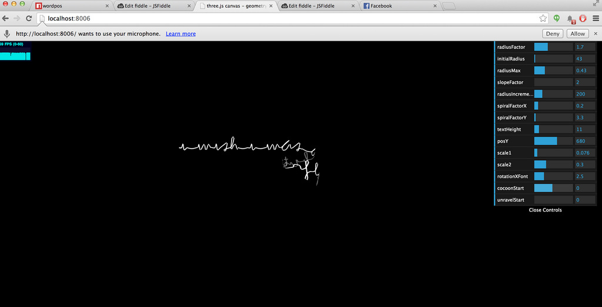

#Cocoon development
Cocoon development was for us quite a long process.
First, we started programming a shader for Three.js to roll wish text into a spiral and spheric shape. Using sliders of dat.GUI to all shader parameters we play with many of them in order to find the right values for each equations we have create. 

Once we had the shader, we realized that a normal text is not a good option. Hence, we came up with an idea to use handwritten typography. The typography is code-based for making an animation of appearing text as it was written by hand. 

Here is the demo video of 'from a wish to a butterfly':
http://youtu.be/NNBHiuqXFmw

During the animation of the cocoon the handwritten text gets more compact in order to create a more solid cocoon where a butterfly is born. We have placed a volumetric light inside the cocoon. The volumetric light suits well for creating a magical moment when a butterfly is created from a cocoon, which was created by a wish. The light traces pass from the spaces between the letters.