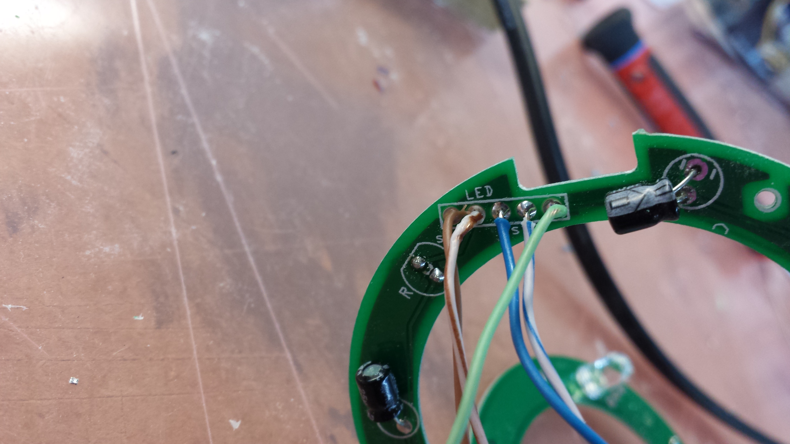
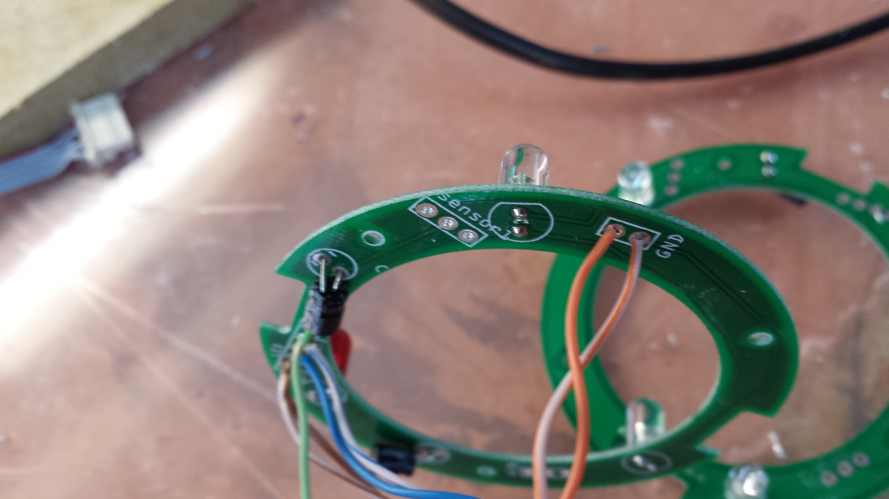
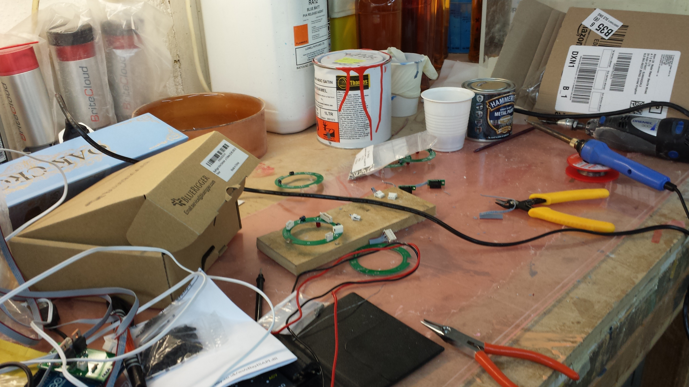
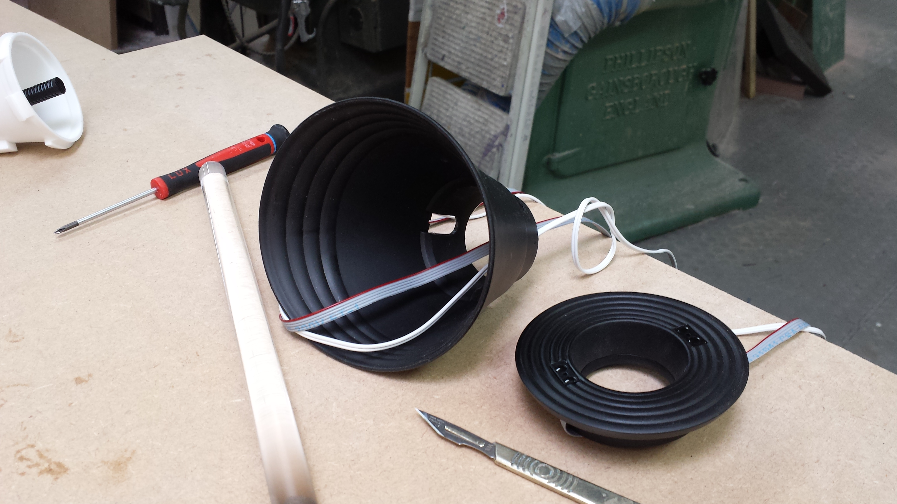
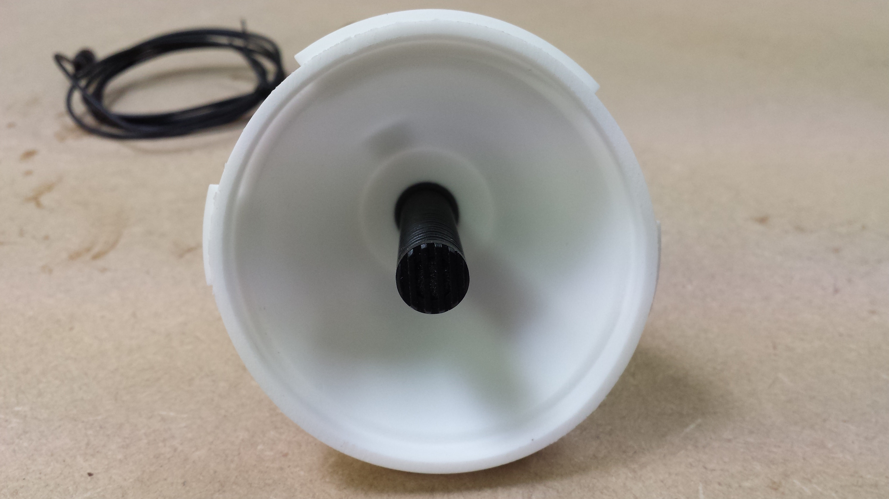
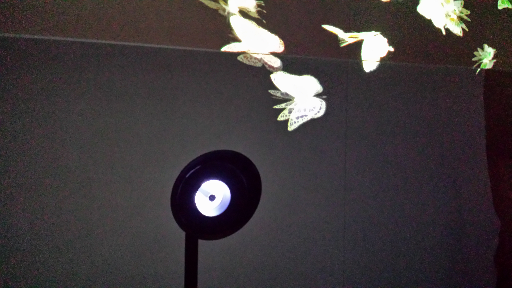

#Cone Assembly
The cone consists of multiple parts: microphone, 2 proximity sensors, bright white and a reg LEDs, arduino, PCBs, some more electonic components.
After designing the cone's 3d model, it got 3d printed for testing that all parts fit. Afterwards the parts got produced from molds.
Also we have design custom size PCB for the cone:

When soldering part was done, the assembly of molded cone parts could begin:

We found a perfect matching mic for the cone:

Ready cone:

Through ligth we aim to communicate interaction to the audience. Pulsating light invites a person to come closer. When close enough and the cone is ready to listen, the pulsating light changes to red as it would record. At this stage one is able to make a wish.